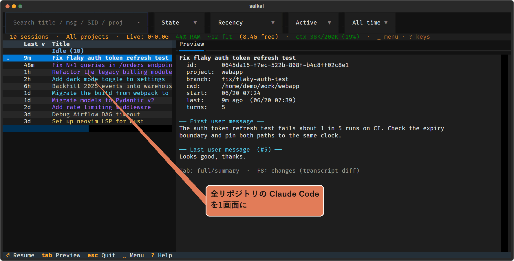
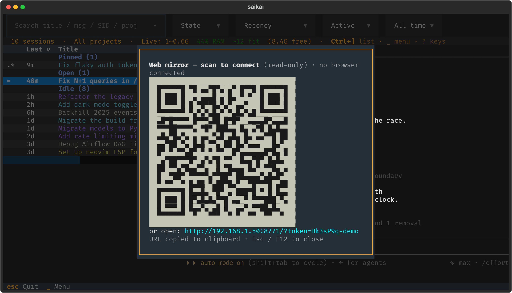

# saikai

[](https://github.com/m-morino/saikai/actions/workflows/ci.yml)
[](https://pypi.org/project/saikai/)
[](https://github.com/m-morino/saikai/releases/latest)
[](LICENSE)
[](https://www.python.org/downloads/)

[English](README.md) | **日本語**

> あちこちに散らばった Claude Code のセッションを、ひとつの画面で見つけて再開するための
> ターミナルアプリです。



## こんな人に向いています

`claude --resume`（`-r`）は、いま開いているフォルダの続きをサッと再開するにはぴったり
です。ただ、リポジトリや worktree をまたいでセッションが増えてくると、「あのとき何を
話していたっけ」を一覧から思い出す・本文で検索する・よく戻る作業に印を付ける、といった
ところまでは手が届きません。saikai はその先を引き受けます。たとえばこんなとき:

- リポジトリや worktree をまたいで増えたセッションを、元のフォルダを覚えていなくても探して再開したい
- タイトルだけでは思い出せない作業を、本文・差分・プレビューから見つけたい
- よく戻るセッションをお気に入りにして、すぐ開きたい

ターミナルアプリにしたのには理由があります。Claude Code がそもそも CLI 中心で、新機能も
CLI から早く試せることが多いし、デスクトップアプリより軽い。Claude Desktop のような横断
ビューを、普段のターミナルでも使いたくて作りました。

## 主な機能

画面は **左がセッション一覧、右が選んだ Claude** の2ペイン構成です（saikai はこれを
split-live と呼びます。既定で有効）。


> **行ったり来たり**: 一覧で `Enter` → 右ペインで Claude ／ `Ctrl+]` で一覧へ戻る ／ `F2` `F3` でペインを切り替え

- **全セッションを1画面で検索。** リポジトリや worktree を横断して、タイトル・本文・
  セッションID で探し、開始したフォルダで再開できます。
- **右側でそのまま Claude を動かし、キー一つで切り替え。** 選んだセッションを右ペインで
  動かしたまま、別のセッションへ行き来できます。
- **状態でまとめて、人手が要るものへ移動。** `~` 作業中 · `?` 入力待ち · `!` 完了・要応答
  でグルーピング／並べ替えし、次に手を入れるべきものへすぐ移れます。
- **お気に入りとプレビューで見分ける。** よく戻るセッションは `f` でお気に入りに。会話の
  プレビュー・変更差分・プロンプト再利用・親子関係の推定もできます。
- **閉じても作業セットは戻せる。** `Shift+F4` で前回のペイン一式を開き直せます。常駐
  プロセスもデータベースも持たず、Claude の履歴ファイルを読むだけ（AI 要約は任意）。
- **★（実験的）重くなったセッションをワンキーで作り直す。** コンテキスト使用量を、
  Claude が記録した実際の値で表示（`ctx 662K/1.0M (66%)`、chars/4 のような概算ではない・
  緑／黄／赤）。`Shift+F11` で `/compact` を送り、**Checkpoint**（`Space` `c`）
  は引き継ぎを書かせて内容を確認させ、Enter で `/clear` → 軽い新セッションに作り直します
  （`Shift+F6` で元へ）。まだ実験的です。
- **スマホ／別ブラウザへミラーリング**（実験的・トークン認証・既定オフ）。詳細は下記
  「Web ミラー」節を参照。

```bash
uv tool install saikai
saikai
```

### 一覧の読み方

タイトルの色は、既定ではプロジェクトごとに分かれます。狭い split 表示で
プロジェクト列が隠れても、同じプロジェクトの作業を見分けられます。
`display.color_by` を `worktree` / `topic` / `none` にすると基準を変えられます。
行頭の記号はセッションの状態です。飽和色は 1 つ(シアン)=**あなたを待っている**
だけ。それ以外は落ち着いたグレーの濃淡なので、対応すべきものに目が行きます:

- **要応答**(シアン): `?` 入力待ち · `!` 処理完了・要応答 · `&` バックグラウンド agent がブロック中
- **実行中**(通常): `~` 作業中 · `@` 別ウィンドウで応答中
- **静か**(dim): `=` 待機中 · `@` 別で開いている · `$` シェル実行中 · `R` Remote Control · `+` アクティブ · `.` 最近 · `&` バックグラウンド agent
- **タグ**(別列): `*` お気に入り · `x` 非表示


## インストール

**Python ≥ 3.11** が必要です。いちばん簡単なのは
[uv](https://docs.astral.sh/uv/) です。PyPI パッケージを隔離環境に入れてくれるので、
venv を自分で用意する手間が要りません:

```bash
uv tool install saikai   # 安定版 → `saikai` が PATH に
```

クローンから:

```bash
uv run saikai.py          # その場で実行（依存は自動インストール）
uv tool install .        # `saikai` コマンドを PATH に入れて: saikai
```

pip / pipx 派でも大丈夫です（依存は `pyproject.toml` から）:

```bash
pipx install saikai   # 隔離環境 + PATH
pip install saikai   # アクティブな環境へ
```

ライブ表示には追加の依存（`pyte`、Windows は `pywinpty` / それ以外は `ptyprocess`）が
要りますが、上記のどのコマンドでも自動で入ります。もし入らなくても、saikai は一覧専用
モードで動きます（後述）。

## 使い方

```bash
saikai                 # 全プロジェクト・全履歴（初期状態。保存済み設定があればそちらを使用）
saikai --here          # 現在のプロジェクト（git リポジトリ）のみ
saikai --days 7        # 直近 7 日のみ（ワンショット。--save-defaults で永続化）
saikai --table         # 静的な一覧（非対話）
saikai --help
```

### キー操作

まず「戻り方」だけ。**ペインから一覧へ戻る = `Ctrl+]`**、**`Esc` で一段ずつ戻る（検索 →
一覧 → 終了）**。この2つを覚えておけば大丈夫。あとは画面（フッター・`?` の全キー一覧・
`␣` メニュー）が教えてくれます。

日常操作: `↑` `↓` 移動 · `Enter` 開く/再開 · `F2`/`F3` でペイン切り替え · `Shift+F3` で次の
要対応ペインへ · `/` か文字で検索 · `Tab` プレビュー切替。

**`Space` がメニュー**: 一覧で `Space` → 1 文字。手が止まると系統別メニューがその場に
出ます（暗記不要）。残りのセッション・ペイン操作はここに揃っています。

| セッション操作 | 表示 | ペイン |
|---|---|---|
| `f` ★ お気に入り | `s` ソート列を切替 (**s**ort) | `n` 新規セッション |
| `h` 非表示 | `o` ソート方向を反転 (**o**rder) | `p` ペイン復元 |
| `e` 名前変更 (edit) | `g` グループ切替 | `z` ペインをフリーズ |
| `y` プロンプトをコピー (yank) | `t` ツリー | `a` 次の要対応ペインへ |
| `d` 変更内容 (diff) | `l` 一覧の表示/非表示 | `x` タブを閉じる · `[` `]` タブ移動 |
| `r` 再読込 | `,` 設定 · `/` バー表示切替 | `Space` 一括起動用マーク |

検索トークン `:fav` `:hidden` `:open` `:active` `:recent`、`Alt+←/→` で境界移動、マウス操作、
キー再割当（`config.toml` の `[keys]`）などは `?` の全キー一覧と[設定](#設定環境変数)から。

ライブ表示が使えない環境では、自動で**一覧専用モード**に切り替わります（`Enter` で全画面
再開）。検索・プレビュー・お気に入りはそのまま使えるので、ピッカーとして十分使えます。
最初から一覧専用で起動するなら `SAIKAI_SPLIT_LIVE=0 saikai`。

## Web ミラー（実験的）

**実験中の機能です。** 環境変数 `SAIKAI_MIRROR=1` を付けて起動したときだけ有効になり、
ライブ UI をスマホや別のブラウザにミラーリングします。稼働中の様子をちらっと見たり、
離れた場所からセッションを操作したり。既定はオフで、起動するたびに作られる固有のトークンで認証します。

```bash
SAIKAI_MIRROR=1 saikai                                   # ループバックのみ (127.0.0.1)
SAIKAI_MIRROR=1 SAIKAI_MIRROR_HOST=192.168.1.50 saikai   # LAN から到達可能
```

起動時にスキャン用の **QR コード**を表示します（URL はクリップボードへコピー）。
`F12` でいつでも再表示でき、URL には実行ごとのアクセストークンが入ります。



ミラーは**既定で read-only** です。**`Shift+F12`**（ローカル専用キー）でブラウザ
**操作**を ON にすると、ブラウザから次のように操作できます:

- **タップ**でクリック（行選択・列ソート・ペインへフォーカス）、**スワイプ**でスクロール
- ソフトキーボード用の**画面上キーバー**（Leader / Esc / Tab / Enter / 矢印 / Ctrl / F12 / List）
- **物理キーボード**（端末同等）。矢印 / Home・End / F キー / Ctrl・Alt 併用 /
  ペインを抜ける `Ctrl+]` / claude を中断する `Ctrl+C`

操作は一定時間操作が無いと自動で OFF になり、**有効化できるのはローカルの
`Shift+F12` だけ**です（ブラウザ側から自分の操作権限を ON にはできません）。LAN
バインド時は `SAIKAI_MIRROR_ALLOW_LAN_INPUT=1` を併用しない限り read-only のまま
です。信頼できるネットワークでのみ使ってください: アクセストークンは URL に含ま
れますが、入力に必要な write-key は認証済みストリーム経由でのみ配られ、URL・QR・
ログには載りません。

想定外の閲覧者に気づけるよう、**接続中のブラウザ数**を表示します（ステータスバーの
`🌐 N`、接続時のトースト、F12 画面のカウント）。

**`claude remote-control` との違い。** Anthropic 純正の Remote Control は 1 セッション
をクラウド経由（claude.ai サインイン）で中継します。saikai のミラーは意図的に異なります：
**LAN 内で完結**（クラウド中継なし・オフライン／エアギャップでも動作）、**claude.ai OAuth 不要**、
そして起動した 1 セッションだけでなく saikai の**マルチセッション全体**をミラーします。
ネットワーク外からセッションを操作したいときは Remote Control、ローカルの全セッションを
手元の端末から眺めたいときは saikai のミラー、と使い分けられます。

## 設定（環境変数）

| 変数 | 既定値 | 意味 |
|---|---|---|
| `SAIKAI_SPLIT_LIVE` | on | ライブペインモード。`0`/`false`/`no`/`off` で無効化 → 一覧専用 + 全画面再開 |
| `SAIKAI_AUTO_REFRESH` | off | バックグラウンド再スキャンの間隔（秒）。`0` は無効、最小有効値は `2` |
| `SAIKAI_SUMMARIZE_ENABLED` | off | `claude -p` による AI 要約を有効化 |
| `SAIKAI_SUMMARIZE_CMD` | — | `claude -p` の代わりに使うサマリ生成コマンド（stdin にプロンプト → stdout にサマリ） |
| `SAIKAI_SUMMARIZE_MODEL` | haiku | `claude -p` で要約するときのモデル |
| `SAIKAI_AUTO_PERMISSION` | off | 常用ワークスペースで `--permission-mode auto` を付ける動作を明示的に有効化 |
| `SAIKAI_MEM_SAFETY` | on | **メモリの唯一のつまみ。** `on`=バランス型ゲート / `off`=真の枯渇時のみ拒否（＋`SAIKAI_MAX_LIVE`）/ `strict`=より早く拒否・余裕を多めに確保・警告でなくハード停止。どのモードでも「ペイン分の RAM が実際に空いていなければ拒否」は維持し、確保する余裕量だけを調整する |
| `SAIKAI_MAX_LIVE` | 64 | 同時ライブペイン数の上限（保険） |
| `SAIKAI_CLAUDE_MB` | 600 | ライブペイン 1 つあたりの推定 RAM（ゲートとステータスバーの `fit` 表示で使用） |
| `SAIKAI_SCROLLBACK` | 2000 | ペインごとに saikai がメモリへ保持するスクロールバック行数。pyte のセル数に効くため、メモリが厳しいマシンでは下げ（例 1000）、履歴を深くしたければ上げる |
| `SAIKAI_COLOR_BY` | project | セッションタイトルの色分け基準: `project` / `worktree` / `topic` / `none` |
| `SAIKAI_SPLIT_RATIO` | 0.34 | 一覧/ペインの初期分割比（境界のドラッグや `Alt+←/→` で変更でき、その値が保存される） |
| `SAIKAI_RELEASE_KEY` | `ctrl+]` | ライブペインから一覧へフォーカスを戻すキー |
| `SAIKAI_MIRROR` | off | ライブ UI をブラウザにミラー。truthy（`1`/`true`/`yes`/`on`）で有効（トークン認証・`Shift+F12` までは read-only） |
| `SAIKAI_MIRROR_HOST` | `127.0.0.1` | ミラーの待受アドレス。別デバイスから繋ぐなら LAN IP を指定 |
| `SAIKAI_MIRROR_PORT` | `0` | ミラーの固定ポート（ファイアウォール規則を当てやすい）。`0` は OS が空きポートを選ぶ |
| `SAIKAI_MIRROR_ALLOW_LAN_INPUT` | off | 非ループバック bind で操作**入力**を許可。未設定なら LAN ミラーは read-only（ループバックは常に入力可） |
| `SAIKAI_MIRROR_TLS` | off | **HTTPS** で配信し、LAN の受動盗聴で token / write-key / キーストロークが取られるのを防ぐ。`SAIKAI_MIRROR_TLS_CERT`+`_KEY` があればそれを、無ければ自己署名証明書を自動生成（`openssl` が必要。ブラウザは初回だけ信頼警告を出す）。証明書が用意できなければ警告して HTTP のまま |
| `SAIKAI_MIRROR_TLS_CERT` / `_KEY` | — | TLS 配信に使う PEM 証明書＋鍵（両方必須）。自己署名の既定を上書き |
| `SAIKAI_MIRROR_ALLOW_ALL_INTERFACES` | off | `0.0.0.0`/`::` のワイルドカード bind を許可（VPN/Docker/Tailscale 含む全 IF を露出）。未設定ならワイルドカードは検出した LAN IP にフォールバック |

<details><summary><b>上級: メモリゲートの細粒度しきい値</b>（通常は不要 — <code>SAIKAI_MEM_SAFETY</code> が自動設定します。ここで設定すればプリセットを上書き）</summary>

| 変数 | 既定（`on`） | 意味 |
|---|---|---|
| `SAIKAI_MAX_MEM_LOAD` | 85 Win / 95 POSIX | このメモリ負荷 % を超えたら拒否/警告。Windows の `dwMemoryLoad` は独立信号、Linux/macOS は可用量からの導出なので既定を高めに |
| `SAIKAI_MAX_MEM_PRESSURE` | 10 | Linux/macOS: 実測メモリ**圧迫**がこの値超で拒否（Linux PSI `some avg10` %、macOS は critical レベル）。Windows 無効 |
| `SAIKAI_MIN_COMMIT_MB` | 2048 | **コミット余裕**を確保（フリーズ対策）。Windows 常時、Linux は厳格 overcommit 時のみ |
| `SAIKAI_MIN_FREE_PHYS_PCT` | 8 | 物理 RAM の空きをこの % 以上確保（マシン相対の反スラッシングフロア） |
| `SAIKAI_MIN_FREE_MB` | 0 | 任意の絶対物理フロア（レガシー、% フロアとの最大値） |
| `SAIKAI_HARD_RAM_GATE` | off | `1` でゲート超過時に警告でなく拒否 |

</details>

同じ項目は任意の **TOML 設定ファイル**でも指定できます（優先順位は
`環境変数 > 設定ファイル > 既定値`）。`[keys]` でのキー再割当も可能です。
`saikai --init-config` でコメント付きテンプレートを生成、`saikai
--print-config` で解決済みの場所と値を確認できます。アプリ内では
**`Space ,`** で Settings 画面が開き、リスト系オプションをその場で変更しつつ、
全設定の解決値と出所を一覧できます（`e` で config.toml をエディタで開く）。

対応しているのは今のところ Claude Code です。起動コマンドや状態の見方といった
エージェントごとの違いは `saikai_provider.py` に切り出してあり、Codex 用も置いて
ありますが、履歴の読み取りとライブ状態の連動が固まるまでは選べないようにしています。
Claude の履歴は `CLAUDE_CONFIG_DIR` も見にいきます。

## プラットフォーム対応

**正式に対応と言えるのは Windows 10 / 11・Python ≥ 3.11 だけです。**
Linux・WSL2 は POSIX PTY 経路を共有していて検証できるので experimental 扱い（レビュー
歓迎）。macOS は**未確認**です。手元に Mac がなく検証できていないため対応を謳ってはいませんが、
動作報告や検証の協力は歓迎します。それ以外のプラットフォームは未対応です。

saikai 本体の大部分は Python + Textual ですが、実 PTY、クリップボード、
プロセス終了、キー入力などの split-live 周辺は OS やホストターミナルの影響を
受けます。現状:

| OS | ライブペイン PTY | クリップボード（フリーズしたペインから） | RAM ゲートの情報源 | 状態 |
|---|---|---|---|---|
| **Windows** 10 / 11 | ConPTY (`pywinpty`) | Win32 `CF_UNICODETEXT`（コードページ安全） | `GlobalMemoryStatusEx` | ✅ **開発・常用環境**（WezTerm 上） |
| **Linux** *（WSL2 含む）* | POSIX PTY (`ptyprocess`) | OSC-52 *（terminal / tmux / SSH側の許可が必要）* | `/proc/meminfo` + PSI + overcommit mode | ⚠️ **experimental・実機レビュアー募集** |
| **macOS** | POSIX PTY (`ptyprocess`) | localは`pbcopy`、remote対応terminalではOSC-52 fallback | `vm_stat` + memory-pressure sysctl *（コミット制限なし）* | ⚠️ **未確認**（手元に Mac がなく検証できていません・報告歓迎） |

- Windows の PTY とクリップボードは、WezTerm と Windows Terminal で同じ
  ConPTY / Win32 API 経路を通ります。ただし、キー入力、描画幅、IME、マウス操作
  まで同一とは限りません。日常利用で確認しているのは WezTerm です。Windows
  Terminal では、IME 変換窓が claude プロンプト位置にアンカーし、フォーカス時に
  カーソルを端末へ再 push してウィンドウ/ペイン切替後も IME を有効に保ちます
  （WezTerm と違い Windows Terminal は、描画でカーソルが配置し直されないと IME を
  無効化するため）。
- **一覧専用モード**（`SAIKAI_SPLIT_LIVE=0`）では PTY とライブペインの
  クリップボード経路を使わないため、最も移植性の高い使い方です。
- 多くの回帰テストは依存がなくても実行できますが、Textual Pilot と実 PTY
  backend の経路まで確認するには依存を入れて `uv run` で実行します:

  ```bash
  # CI と同じくスイート全体を実行 (Pilot + 実 PTY パスを含む):
  for t in tests/test_*.py; do uv run python "$t"; done
  ```

- Linux / WSL2 / macOS のレビュアーを募集しています（開発は Windows で、Mac が
  手元にないため macOS の検証報告は特に歓迎）。お使いのターミナル名、ローカルか
  SSH/tmux 経由か、PTY 終了・キー入力・クリップボードの結果を issue で共有してください。
- CI では Windows・Linux・macOS それぞれの実 PTY backend を入れて、spawn・resize・
  出力・EOF を smoke test しています。ただし、ターミナルエミュレータ・SSH・tmux・
  IME・クリップボードの方針を組み合わせた対話的な実機レビューの代わりにはなりません。

## コントリビュート

Issue / PR を歓迎します。開発環境の準備、テストの実行方法、split-live ペインを
デッドロックさせないための**並行処理の不変条件**（スレッド周りを触る前に必読）
は [CONTRIBUTING.md](CONTRIBUTING.md) を参照してください。変更履歴は
[CHANGELOG.md](CHANGELOG.md) に記録しています。

## セキュリティ

脆弱性は非公開で報告してください（[SECURITY.md](SECURITY.md) 参照）。
セキュリティ問題を公開 issue にしないようお願いします。

## ライセンス

saikai は [MIT License](LICENSE) で公開しています。別途インストールされる
サードパーティパッケージ（textual、pyte、pywinpty/ptyprocess）に依存します
（[THIRD-PARTY-NOTICES.md](THIRD-PARTY-NOTICES.md) 参照）。なお `pyte` は
LGPL-3.0 ですが、無改変・別インストールの依存として利用しているため、saikai
自身のコードは MIT のままです。
