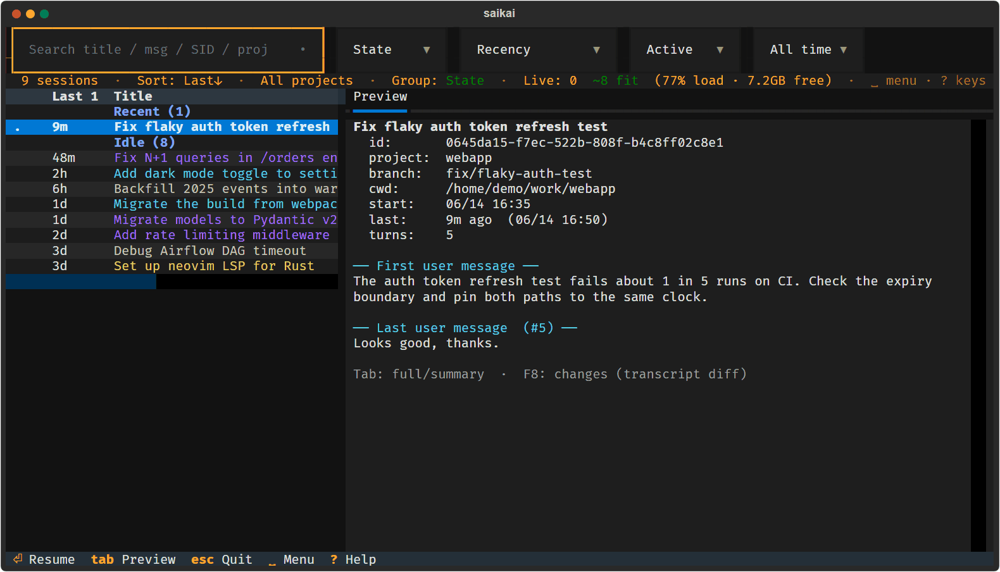
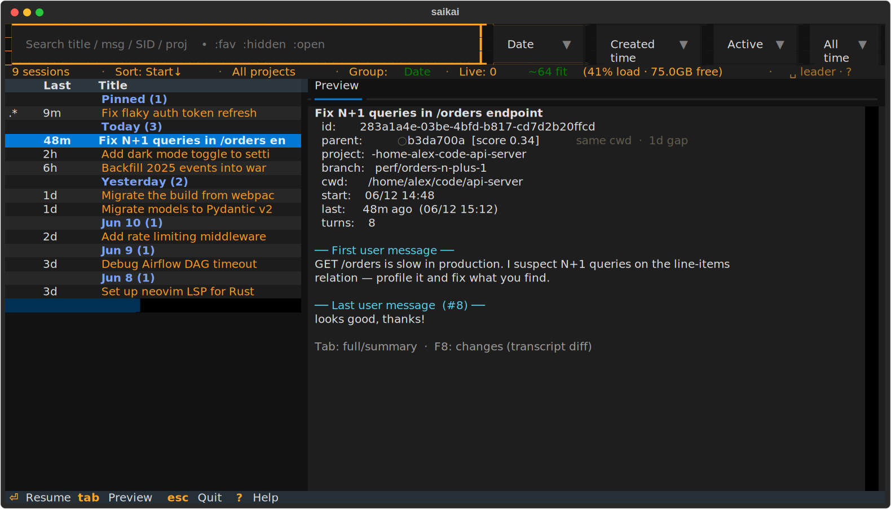
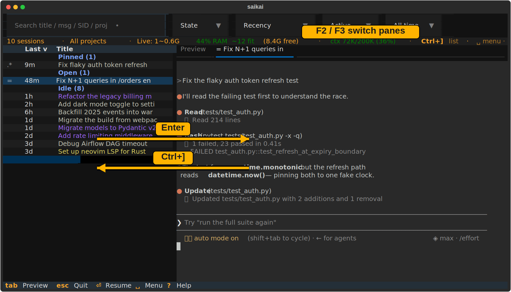

# saikai

[](https://github.com/m-morino/saikai/actions/workflows/ci.yml)
[](LICENSE)
[](https://www.python.org/downloads/)

**English** | [日本語](README.ja.md)

Dozens of Claude Code sessions, one searchable table. saikai scans your entire
`~/.claude/projects` history, lets you filter and group by date / project /
topic, and resumes any session with `Enter`. By default (**split-live**) it keeps
several sessions running live in tabs beside the list — jump between conversations
without closing anything or losing scrollback.

*saikai* = 再開 "resume" + 再会 "reunion" (Japanese). Complements
[ccmanager](https://github.com/kbwo/ccmanager), which manages a live multi-agent
roster; saikai is for navigating and resuming the history.

<!-- swap the next line for the GIF once recorded:
     
-->


<sub>Screenshots show fictional demo data — regenerate with
`uv run scripts/make_screenshots.py`. Record an animated GIF with
`uv run scripts/record_demo.py` ([asciinema](https://asciinema.org/) required)
then `agg saikai-demo.cast saikai-demo.gif`.</sub>

## Highlights

- **Every session, one table** — every Claude Code conversation on your
  machine, sorted by real last activity, grouped by date / project / topic,
  filtered as you type.
- **Resume in place** — `Enter` reopens a session with `claude --resume` in the
  working directory it was started from (worktree-aware).
- **Split-live panes** — host several live `claude` sessions in tabs beside the
  list; markers show at a glance who is busy `~`, waiting for your input `?`,
  or finished `!`. Quit and `Shift+F4` restores the whole pane set later.
- **Session hygiene** — favorite `★`, hide, rename; AI one-line titles; an
  inferred parent/child tree and LLM topic clusters for big histories.
- **RAM-aware** — a memory gate (commit headroom + load + physical floor)
  warns before a new pane would push the machine into thrashing.
- **Keyboard-first** — everything works without a mouse: `Space` is a leader
  key with mnemonic letters (`Space f` = favorite, `Space s` = sort …),
  `Alt+←/→` resizes the split, `?` shows the live key map. The mouse is a
  bonus (click to sort, drag the divider), never a requirement.
- **Unintrusive by design** — read-only over claude's own transcript files; no
  daemon, no database. Two Python files on top of
  [Textual](https://github.com/Textualize/textual), MIT-licensed.

> The live pane uses ConPTY on Windows and a POSIX PTY elsewhere — see
> [Platform support](#platform-support) for the per-OS verification status
> (Windows is the verified platform today).

## Install

Requires **Python ≥ 3.11**. The easiest path is
[uv](https://docs.astral.sh/uv/) — it resolves the deps from the inline PEP-723
header, no manual venv:

```bash
uv tool install git+https://github.com/m-morino/saikai   # no clone needed → `saikai` on PATH
```

From a clone:

```bash
uv run saikai.py          # run in place (deps auto-installed)
uv tool install .        # install the `saikai` command on your PATH, then: saikai
```

Prefer pip / pipx? Both work (deps come from `pyproject.toml`):

```bash
pipx install git+https://github.com/m-morino/saikai   # isolated + on PATH
pip install .                                         # into the active environment
```

The split-live pane needs the PTY deps (`pyte`, and `pywinpty` on Windows /
`ptyprocess` elsewhere); they install automatically with any command above. If
they're somehow missing, saikai still runs in list-only mode (see below).

## Usage

```bash
saikai                 # every project, full history (the default)
saikai --here          # only the current project (git repo)
saikai --days 7        # only the last 7 days (one-shot; --save-defaults persists)
saikai --table         # static, non-interactive table
saikai --help
```

### Keys

| Key | Action |
|-----|--------|
| `↑` `↓` / `Enter` | move / resume the selected session |
| `/` or just type | open the search & filter bar (`Esc` closes it, keeps the filter) |
| `F5` | refresh · `F6` ★ favorite · `F7` hide · `F8` changes (diff) · `F9` copy opening prompt |
| `Shift+F2` | rename the session — type your own name (empty clears it → back to auto title) |
| `Shift+F5/F6/F7` | tree / cluster / cycle grouping |
| `Tab` | preview: full ↔ summary · `?` help · `Esc` quit |

**Search tokens** (combine with text and each other): `:fav` `:hidden` `:open`
`:active` `:recent`. Group / Sort / Status / Age also have top-bar dropdowns.

### Keyboard-first: the Space leader

saikai is fully usable without a mouse — the mouse is a bonus, never a
requirement. Press **`Space`** in the list (the *leader*), then one mnemonic
letter. Hesitate after `Space` and the full map pops up, grouped by family
(which-key style); `?` shows the same grouped map any time:

| Session | View | Panes |
|---|---|---|
| `f` ★ favorite | `s` cycle **s**ort column | `n` new session |
| `h` hide | `o` flip sort **o**rder | `p` restore panes |
| `e` rename (edit) | `g` cycle grouping | `z` freeze pane |
| `y` copy prompt (yank) | `t` tree · `c` cluster | `a` next attention |
| `d` diff (changes) | `l` hide/show list | `x` close tab · `[` `]` tabs |
| `r` refresh | `,` settings | `Space` mark for batch launch |

The leader fires **only while the session list is focused** — a live claude
pane or the search box always receives its own keys. More keyboard parity:

- **Resize the split**: `Alt+←` / `Alt+→` nudge the list/pane divider (the
  position persists, exactly like dragging it).
- **Dropdowns**: `/` shows the filter bar; `Tab` / `Shift+Tab` walk into the
  Group / Sort / Status / Age dropdowns, `Enter` opens one.
- **Everything** else already has an F-key (tables above) and `?` lists the
  live bindings, including your remaps.

Don't like the defaults? In `config.toml`: `[keys] leader = "none"` turns the
mode off (Space then marks directly, as before), `leader = "ctrl+g"` moves it,
`leader_defaults = false` empties the map, and any `action = "x"` single-letter
entry remaps one sequence. **Mouse extras** (never required): click a column
header to sort, drag the divider, click rows and dropdowns.

### Split-live (default)



saikai runs real interactive `claude` processes in tabs beside the list whenever
its PTY deps (`pyte`, `pywinpty`/`ptyprocess`) are present — they ship as
dependencies, so this is the default. To opt out and use the lightweight
list-only browser (`Enter` = full-screen takeover resume), set the env var:

```bash
SAIKAI_SPLIT_LIVE=0 saikai     # also: false / no / off
```

| Key | Action |
|-----|--------|
| `Enter` | open / focus a live pane for the selected session |
| `Shift+F8` | start a NEW claude session in any folder / git worktree |
| `Shift+F4` | reopen the panes from your last session (snapshot + resume) — anytime |
| `F2` / `F3` | previous / next live tab |
| `Shift+F3` | jump to the next pane needing attention (`?` waiting / `!` finished) |
| `F4` | hide / show the session list (full-width pane) |
| `Ctrl+]` | return focus from a pane back to the list (`SAIKAI_RELEASE_KEY` to change) |
| `F10` / `Shift+F10` | close the active tab / close all tabs (explicit close — *not* restored) |
| `Esc` / `Ctrl+C` | quit: snapshot the open panes, then kill them all (`Shift+F4` reopens them next launch) |
| scroll up | freeze the pane (copy mode): select/copy while claude keeps running |

Markers in the list: `~` busy · `?` waiting for input · `!` finished (unanswered)
· `@` open · `+` active · `.` recent · `*` favorite · `x` hidden.

## Configuration (environment variables)

| Variable | Default | Meaning |
|---|---|---|
| `SAIKAI_SPLIT_LIVE` | on | live-pane mode; set `0`/`false`/`no`/`off` to disable → list-only browser + full-takeover resume |
| `SAIKAI_AUTO_REFRESH` | off | seconds between background re-scans |
| `SAIKAI_SUMMARIZE_CMD` | — | command to summarize with (prompt on stdin → summary on stdout) instead of `claude -p` |
| `SAIKAI_MAX_MEM_LOAD` | 85 | refuse/warn opening a pane above this memory-load % (Win `dwMemoryLoad`; Linux/macOS derived) |
| `SAIKAI_MIN_COMMIT_MB` | 2048 | keep this much **commit headroom** free — the system-freeze guard (Win/Linux) |
| `SAIKAI_MIN_FREE_PHYS_PCT` | 8 | keep ≥ this % of physical RAM available (anti-thrash floor, machine-relative) |
| `SAIKAI_CLAUDE_MB` | 600 | estimated RAM per live pane |
| `SAIKAI_MIN_FREE_MB` | 0 | optional absolute physical floor (legacy; max'd with the % floor) |
| `SAIKAI_HARD_RAM_GATE` | off | `1` refuses (vs warns) when the gate would be crossed |
| `SAIKAI_MAX_LIVE` | 64 | hard cap on concurrent live panes (backstop) |
| `SAIKAI_SCROLLBACK` | 2000 | per-pane scrollback lines kept in memory. **Biggest lever on the live process's RAM** (a full pane ≈ cols×lines pyte cells); lower it (e.g. 1000) on a memory-tight machine, raise for deeper history |
| `SAIKAI_COLOR_BY` | project | what tints the session title: `project` / `worktree` / `topic` / `none` |
| `SAIKAI_SPLIT_RATIO` | 0.34 | initial list/pane split (drag the divider to change; the dragged value persists) |

saikai also reads an optional **TOML config file** for these same knobs (with
`env > config > default` precedence) plus `[keys]` rebinds. Run `saikai
--init-config` to write a documented template, `saikai --print-config` to see the
resolved location and values — or press **`Space ,`** inside the app: the
Settings screen edits the list options in place and shows every config knob
with its resolved value and source (`e` there opens config.toml in your editor).

## Platform support

**Supported platforms (deliberately bounded): Windows, Linux — including WSL —
and macOS, on Python ≥ 3.11.** Other platforms are *unsupported*: saikai may still
run on another POSIX OS via the generic POSIX path (and it degrades safely rather
than crashing), but that's untested and not a target.

saikai itself is pure Python + Textual; the **split-live pane** is the only
platform-specific part (it drives a real PTY and the clipboard). Honest status:

| OS | Live-pane PTY | Clipboard (from a frozen pane) | RAM gate source | Status |
|---|---|---|---|---|
| **Windows** 10 / 11 | ConPTY (`pywinpty`) | Win32 `CF_UNICODETEXT` (codepage-safe) | `GlobalMemoryStatusEx` | ✅ **developed & daily-driven** (on WezTerm) |
| **Linux** *(incl. WSL)* | POSIX PTY (`ptyprocess`) | OSC-52 *(needs an OSC-52-capable terminal)* | `/proc/meminfo` | ⚠️ code-complete, **not yet run by the author** |
| **macOS** | POSIX PTY (`ptyprocess`) | OSC-52 *(iTerm2 / kitty / WezTerm fine; Terminal.app needs it enabled)* | `sysctl` + `vm_stat` *(load + physical; no commit limit)* | ⚠️ code-complete, **not yet run by the author** |

- **Terminal-agnostic on Windows:** the clipboard goes through the Win32
  `CF_UNICODETEXT` API and the PTY through ConPTY, neither of which depends on
  the host terminal — so **Windows Terminal** uses the same code paths as WezTerm
  (verified terminal) and is expected to behave identically.
- **List-only mode** (`SAIKAI_SPLIT_LIVE=0`) has no PTY dependency and should run
  anywhere Textual runs.
- The headless regression tests are platform-independent (they stub out
  textual / pyte / pywinpty) and pass on the dev machine — run them with plain
  `python` (no deps needed):

  ```bash
  python tests/test_config.py
  python tests/test_sort_recency.py
  python tests/test_split_divider.py
  python tests/test_terminal_concurrency.py
  python tests/test_resource_bounds.py
  python tests/test_terminal_watchdog.py
  python tests/test_keyboard_leader.py
  ```

- Ran it on Linux or macOS? Please open an issue with the result (and any PTY /
  clipboard quirks) so these rows can move to ✅.

## Contributing

Issues and PRs welcome — see [CONTRIBUTING.md](CONTRIBUTING.md) for the dev
setup, how to run the test suites, and the **concurrency invariants** that keep
the split-live pane from deadlocking (read those before touching threading code).
Changes are documented in [CHANGELOG.md](CHANGELOG.md).

## Security

Please report vulnerabilities privately — see [SECURITY.md](SECURITY.md). Don't
open a public issue for a security problem.

## License

saikai is released under the [MIT License](LICENSE). It depends on a few
third-party packages installed separately (textual, pyte, pywinpty/ptyprocess) —
see [THIRD-PARTY-NOTICES.md](THIRD-PARTY-NOTICES.md). Note `pyte` is LGPL-3.0; it
is used as an unmodified, separately-installed dependency, which keeps saikai's
own code MIT.
